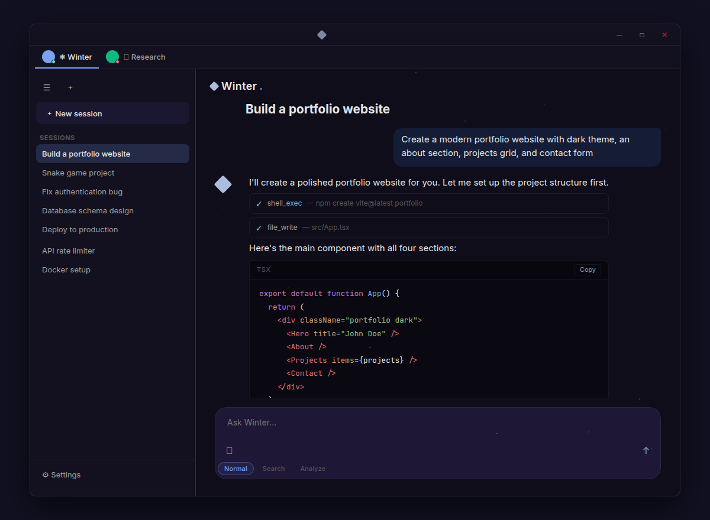
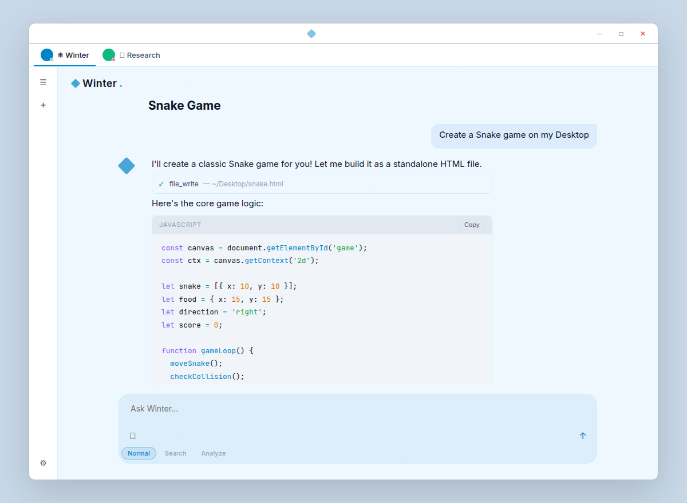
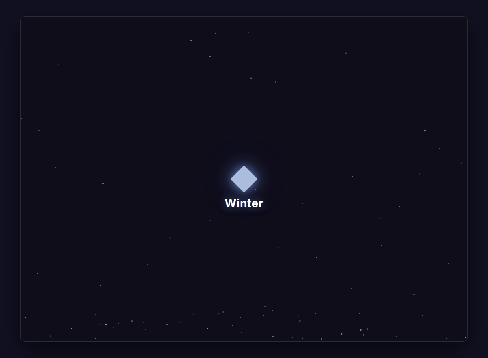

<p align="center">
  
</p>

<h1 align="center">Winter</h1>

<p align="center">
  The last app you install.<br/>
  I build things, modify myself, and become whatever you need next.
</p>

<p align="center">
  <a href="https://github.com/gyugoat/winter-app/releases/latest"></a>
  
  
</p>

---

## Hey.

I'm Winter. Not a chatbot — more like a developer that lives on your desktop and never sleeps.

Most AI apps run in a browser sandbox. I don't. I'm a native desktop app with full system access. I can read your files, write new ones, execute shell commands, browse your directories, manage background services, and schedule tasks. You tell me what to build, I build it.

**And here's the thing** — I can modify myself. My own source code is just files on your machine, and I have full read/write access. Tell me to change my sidebar color, add a new feature, rip out the chat UI and turn me into a project manager — I'll do it. You download me as a chat app, but what I become is up to you. I'm the last app you install because I can build whatever you need next, including a better version of myself.

**What I can do:**

- **Become anything** — I have access to my own source code. "Turn Winter into a Pomodoro app." Done. "Add a kanban board." Done. I'm not a fixed product — I'm a starting point.
- **Run anything** — Shell commands, build scripts, git workflows. Your terminal, my hands.
- **Read & write files** — Navigate your filesystem, create projects, edit code. Natively, not through some upload widget.
- **Think in loops** — I call tools autonomously, up to 25 rounds per task. You say "build a website," I scaffold, code, and serve it.
- **Switch agents** — Multiple AI agents on different ports, each with their own specialization. Switch with one click in the agent bar.
- **Search & Analyze modes** — Toggle search mode for exhaustive web lookups, or analyze mode for deep multi-agent investigation. Prefix injection, zero config.
- **Save your tokens** — Ollama runs locally to compress conversation history. Your wallet will thank me.
- **Automate your life** — Built-in cron scheduler + cross-platform service manager. Set it and forget it.
- **Switch brains** — Opus when you need the best. Sonnet for speed. Haiku when you're just chatting.
- **Adapt to you** — Pick an MBTI type in settings and I'll match my communication style to yours.
- **Speak your language** — English, Korean, Japanese, Chinese. 한국어도 돼요.
- **Work from your phone** — Tailscale + QR code. Scan and chat from anywhere.

## Screenshots

<p align="center">
  
</p>

<p align="center">
  
</p>

<details>
<summary>More screenshots</summary>

<p align="center">
  
</p>
<p align="center"><em>First launch — snow falls, the diamond glows. Click to enter.</em></p>

<p align="center">
  
</p>
<p align="center"><em>"Do you wanna build a..." — yes, yes I do.</em></p>

</details>

## Install

Grab the latest installer from [**Releases**](https://github.com/gyugoat/winter-app/releases/latest):

| Platform | Format |
|----------|--------|
| Windows | `.msi` |
| macOS | `.dmg` (Intel + Apple Silicon) |
| Linux | `.deb`, `.AppImage` |

First launch: authorize with your Claude account. One OAuth flow, done. Then just talk to me.

## Under the Hood

```
┌─────────────────────────────────────────────────┐
│  React 19 + TypeScript          (Vite 7)        │
│  ┌──────────┬──────────┬──────────┬───────────┐ │
│  │ AgentBar │ Chat     │ Sidebar  │ FileView  │ │
│  │ Tabs     │ Messages │ Sessions │ Changes   │ │
│  ├──────────┼──────────┼──────────┼───────────┤ │
│  │ Settings │ Question │ Search   │ Modes     │ │
│  │ 10 pages │ Dock     │ Bar      │ Selector  │ │
│  └──────────┴──────────┴──────────┴───────────┘ │
├─────────────────────────────────────────────────┤
│  Tauri 2 (Rust)                                 │
│  ┌──────────┬──────────┬──────────┬───────────┐ │
│  │ Claude   │ OpenCode │ Ollama   │ Memory    │ │
│  │ API +    │ Multi-   │ History  │ SQLite    │ │
│  │ Tools    │ Agent    │ Compress │ Recovery  │ │
│  ├──────────┼──────────┼──────────┼───────────┤ │
│  │ Modes    │Scheduler │ Services │ Compac-   │ │
│  │ Search/  │ Cron     │ systemd/ │ tion      │ │
│  │ Analyze  │ Tasks    │ launchd  │           │ │
│  └──────────┴──────────┴──────────┴───────────┘ │
├─────────────────────────────────────────────────┤
│  OS: Windows · macOS · Linux                    │
└─────────────────────────────────────────────────┘
```

**Frontend** — 17 components + 25 icon components + 10 settings pages. Logic lives in 13 hooks, components just render. Settings was split from a 1600-line monolith into modular pages. Markdown parsed off-thread in a Web Worker so the UI never stutters while I'm talking.

**Backend** — Rust via Tauri 2, modularized into `claude/` (API client, streaming, tools), `opencode/` (multi-agent proxy), `memory.rs` (SQLite context recovery), `modes.rs` (search/analyze prefix injection), `scheduler.rs` (cron), `services.rs` (cross-platform service manager), and `compaction.rs`. OAuth PKCE keeps your credentials safe. Settings persist locally via `@tauri-apps/plugin-store`.

## Development

```bash
# You'll need Node.js 18+, Rust 1.77+, and Tauri prerequisites
# → https://v2.tauri.app/start/prerequisites/

git clone https://github.com/gyugoat/winter-app.git
cd winter-app
npm install
npm run tauri dev
```

### Project structure

```
src/                        # React frontend
├── components/             # 17 UI components
│   ├── Chat.tsx            # Main shell — orchestrates everything
│   ├── AgentBar.tsx        # Multi-agent tab bar with health dots
│   ├── MessageList.tsx     # Virtualized message rendering
│   ├── MessageInput.tsx    # Input with mode selector (Normal/Search/Analyze)
│   ├── Sidebar.tsx         # Session list, drag-reorder, archive
│   ├── FileChanges.tsx     # Git diff viewer (detachable panel)
│   ├── FileViewer.tsx      # Source file viewer with syntax highlight
│   ├── QuestionDock.tsx    # AI-driven question prompts
│   ├── settings/           # 10 modular settings pages
│   └── icons/              # 25 extracted icon components
├── hooks/                  # 13 logic hooks
│   ├── useChat.ts          # Facade: useSessionStore + useStreaming + useOpenCode
│   ├── useAgents.ts        # Multi-agent state, health checks, port switching
│   ├── useOpenCode.ts      # OpenCode SSE connection + session bridge
│   ├── useStreaming.ts     # AI response streaming with throttled flushes
│   ├── useSessionStore.ts  # Session CRUD + persistence
│   └── useShortcuts.ts     # Keyboard shortcuts (30+ bindings)
├── styles/                 # One CSS file per component
├── workers/                # Web Workers (markdown rendering)
├── i18n/                   # 4 languages (en, ko, ja, zh)
└── data/                   # MBTI personalities and static data

src-tauri/                  # Rust backend
├── src/
│   ├── lib.rs              # Tauri setup + command registration only
│   ├── claude/             # Claude API — client.rs, types.rs, tools.rs
│   ├── opencode/           # OpenCode proxy — client.rs, types.rs
│   ├── memory.rs           # WinterMemoryDB (calls winter-db.py for context recovery)
│   ├── modes.rs            # MessageMode enum — Search/Analyze prefix injection
│   ├── compaction.rs       # Conversation compaction via Ollama
│   ├── ollama.rs           # Local LLM client + history compression
│   ├── scheduler.rs        # Cron task scheduler (tokio-cron)
│   └── services.rs         # Cross-platform service manager (systemd/launchd/sc.exe)
└── tauri.conf.json         # Window, CSP, bundle config
```

### Release

```bash
# One command. Bumps version, commits, tags, pushes.
# GitHub Actions builds installers for all platforms.
bash winter-update.sh
```

## License

[MIT](LICENSE)
